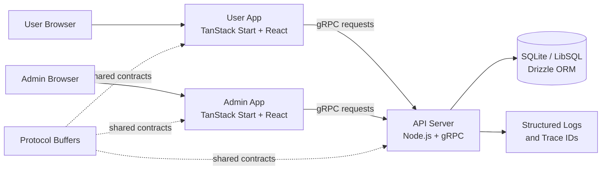
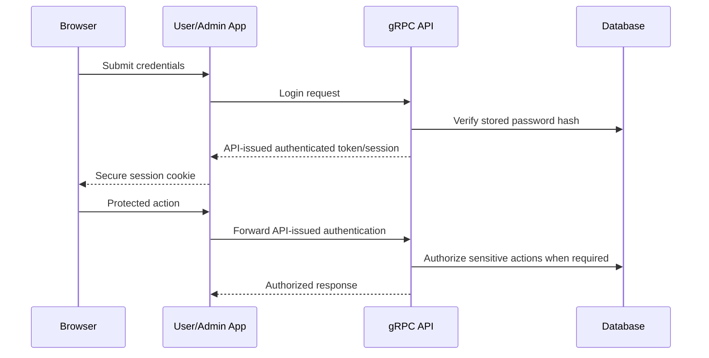

# RelayHaven Social - Full-Stack Social Media Platform

RelayHaven Social is a production-oriented social media platform built as a TypeScript monorepo with a consumer web application, an administration console, and a gRPC API. It is designed to demonstrate full-stack product development alongside secure authentication, efficient data access, observability, accessibility, and dependable delivery practices.

**Tagline:** Connect, share and engage in a safer social space.

> **Development status:** The repository begins with a functional social-platform baseline and is being developed under the RelayHaven Social identity. Features and platform improvements marked **Planned** below represent the consolidated product roadmap and should be checked off as they are implemented.

---

## Product Vision

RelayHaven Social is a community-focused social platform where users can publish short posts, interact through likes and comments, follow accounts, save bookmarks, receive notifications, and discover new content. The target version expands that foundation with real reposts, content warnings, drafts, mention assistance, infinite feeds, keyboard-first navigation, hardened authentication, optimized API queries, structured observability, and production-grade testing and CI.

The project is intentionally broader than a basic CRUD application. It is intended to show how a user-facing feature set is supported by secure backend boundaries, well-designed API contracts, performant data retrieval, and operational quality.

---

## Capability Map

### Current Baseline Capabilities

| Area | Available functionality |
| --- | --- |
| Authentication | Registration, login, session validation and logout flow |
| Posts | Create, view, update and delete posts; 280-character post model |
| Discussions | Comments with one level of nested replies |
| Engagement | Like/unlike posts and comments; bookmark posts |
| Social graph | Follow/unfollow users; follower and following counts |
| Discovery | Home feed, explore feed, search for posts and users |
| Profiles | Public user profiles and profile editing |
| Notifications | Likes, comments, follows and mention-related notifications |
| Moderation | Admin dashboard, role management, bans, reports, content moderation and audit logs |

### Superset Product Roadmap

| Capability | Status | Product outcome |
| --- | --- | --- |
| Reposts / reposts | Planned | Users can share another user's post on their own profile and undo the action |
| Repost metadata in feeds | Planned | Cards display repost counts, viewer state and original-author context |
| Mention autocomplete | Planned | Composer suggests matching users while typing valid `@username` mentions |
| Infinite scroll | Planned | Home and Explore feeds progressively load content and restore scroll position |
| Keyboard-driven navigation | Planned | Feeds are usable without a mouse through documented shortcuts |
| Composer drafts | Planned | One in-session draft is preserved across navigation and cleared on publish |
| Content warnings | Planned | Authors can hide sensitive content behind an explicit reveal action |
| Secure credential storage | Planned | Legacy password hashes upgrade incrementally to a modern password-hashing algorithm |
| API-owned authentication trust | Planned | Only the API issues trusted identity and authorization tokens |
| Optimized post-card queries | Planned | Feeds, profiles, bookmarks and search avoid per-post database enrichment queries |
| Unified errors and tracing | Planned | gRPC failures are classified consistently and requests carry trace IDs |
| Isolated testing and CI | Planned | Repeatable tests and automated validation protect all product flows |

---

## Architecture



### Target authentication boundary



**Security principle:** client applications may forward authentication material, but they must not manufacture API-trusted identity or administrator role claims.

---

## Monorepo Structure

```text
relayhaven-social-platform/
├── apps/
│   ├── api/                    # gRPC backend and domain services
│   │   ├── src/grpc/           # Server and request handlers
│   │   ├── src/services/       # Business logic and database operations
│   │   └── tests/              # API unit and service tests
│   ├── client-user/            # Consumer-facing social application
│   │   ├── src/components/     # Feed, post, profile and composer UI
│   │   ├── src/routes/         # TanStack Start routes
│   │   ├── src/server/         # Server functions communicating with API
│   │   └── tests/              # Unit and Playwright E2E tests
│   └── client-admin/           # Administration and moderation application
│       ├── src/components/
│       ├── src/routes/
│       ├── src/server/
│       └── tests/
├── packages/
│   ├── db-schema/              # Drizzle schema definitions
│   ├── proto/                  # Protocol Buffer contracts and generated types
│   ├── grpc-client/            # Shared gRPC client layer
│   ├── shared-types/           # Shared TypeScript models
│   └── ui/                     # Shared UI components and styles
├── db/migrations/              # Database migrations
├── tooling/typescript/         # Shared TypeScript configuration
├── turbo.json                  # Monorepo task orchestration
└── package.json                # Workspace scripts and dependencies
```

---

## Technology Stack

| Category | Technology |
| --- | --- |
| Language | TypeScript |
| Frontend framework | React 19 with TanStack Start |
| Styling | StyleX |
| API transport | gRPC with Protocol Buffers |
| Database | SQLite / LibSQL with Drizzle ORM |
| Monorepo tooling | pnpm workspaces and Turborepo |
| Formatting and linting | Biome |
| Unit testing | Vitest |
| End-to-end testing | Playwright |

---

## Applications

### User Application

The user application is the main consumer experience. It supports authentication, publishing, conversations, discovery and social interactions.

**Current functionality**

- Sign up, sign in and session-aware navigation.
- Create, edit and delete posts.
- View home and explore feeds.
- Comment on posts and reply within one nested level.
- Like posts and comments.
- Bookmark posts and revisit saved content.
- View and edit profiles.
- Follow accounts and view social counts.
- Search posts and users.
- Receive interaction notifications.

**Planned product enhancements**

- Repost and undo-repost actions with visible counts and profile-feed presentation.
- Composer mention suggestions with caret-aware insertion and keyboard support.
- Infinite-scroll feeds with navigation/scroll restoration.
- Keyboard shortcuts for post focus, open, like, bookmark, repost and reply actions.
- Help overlay documenting shortcuts.
- Automatic single-draft preservation during a session.
- Optional content warning labels with reveal-before-display behaviour.

### Admin Application

The admin application provides platform governance tools.

**Current functionality**

- Dashboard statistics.
- User discovery, role updates, suspension and unsuspension.
- Post and comment moderation.
- Report review workflows.
- Administrative audit-log visibility.

**Target hardening**

- API-authoritative role verification for privileged actions.
- Traceable administrative operations with request context.
- Consistent authorization errors and action auditability.

### API Server

The backend exposes gRPC services for the user and admin clients, applies domain rules, and interacts with the database through Drizzle ORM.

**Existing service domains**

| Service | Responsibility |
| --- | --- |
| `AuthService` | Register, login, logout, current-user and session validation flows |
| `UsersService` | Profiles and profile updates |
| `PostsService` | Post creation, retrieval, update, deletion and user posts |
| `CommentsService` | Comment creation, retrieval and deletion |
| `LikesService` | Post/comment like state and mutations |
| `FollowsService` | Follow state and counts |
| `BookmarksService` | Bookmark state and bookmarked-post retrieval |
| `NotificationsService` | Notification list, count, read and delete actions |
| `SearchService` | Post and user discovery |
| `FeedService` | Home and explore feeds |
| `AdminService` | Moderation, reporting, user administration and audit actions |

**Planned service extension**

| Service | Responsibility |
| --- | --- |
| `RepostsService` | Create/delete reposts and return viewer repost state |

---

## Domain Model

### Existing tables

| Table | Responsibility |
| --- | --- |
| `users` | Accounts, public profile data, roles and ban metadata |
| `posts` | User-created posts |
| `comments` | Post comments and nested replies |
| `likes` | Likes for posts or comments |
| `follows` | User follower/following relationships |
| `bookmarks` | User-saved posts |
| `notifications` | Interaction notifications |
| `reports` | Moderation reports submitted against content or accounts |
| `audit_logs` | Administrative action history |

### Planned schema additions

| Change | Purpose |
| --- | --- |
| `reposts` table | Persist one repost per user/post pair with creation time |
| `posts.content_warning` nullable field | Persist optional author-provided warning text |
| `sessions` or refresh-token table | Support token revocation, logout management and secure session lifecycle |

### Repost business rules

- A user may repost another user's post only once.
- A user may undo their repost.
- A user may not repost their own post.
- Deleting the original post removes related reposts through referential cleanup.
- Profile activity should distinguish original posts from reposted posts.
- Feed and profile responses should include repost count and viewer-specific repost status.

---

## API Contract Direction

Protocol Buffer definitions live in `packages/proto/protos/`. Existing contracts should remain backward compatible while the post response becomes rich enough to serve all feed views consistently.

### Target post-card response

Each rendered post card should receive one complete response model rather than issuing separate lookups per UI control.

```ts
interface PostCardView {
  id: string;
  content: string;
  author: Author;
  createdAt: Date;
  updatedAt: Date;
  likeCount: number;
  commentCount: number;
  repostCount: number;
  isLiked: boolean;
  isBookmarked: boolean;
  isReposted: boolean;
  contentWarning?: string;
  repostContext?: {
    reposter: Author;
    repostedAt: Date;
  };
}
```

### New API capabilities to implement

```text
RepostsService.CreateRepost
RepostsService.DeleteRepost
RepostsService.GetRepostStatus
PostsService.CreatePost        # extended with optional content warning
PostsService.UpdatePost        # extended with optional content warning
PostResponse                    # extended with card state and warning metadata
```

When extending `.proto` contracts, new fields must use new field numbers; existing field numbers must not be changed or reused.

---

## Security and Authorization Roadmap

The target platform treats authentication and authorization as core product requirements, not later refinements.

### Password protection

**Target approach**

- Hash new passwords using a modern password hashing algorithm such as Argon2id.
- Support legacy password verification during migration.
- After a successful legacy login, immediately replace the legacy hash with a modern hash.
- Never log plaintext passwords or raw credentials.

### Token trust boundary

**Target approach**

- The API is the sole issuer of trusted user identity and role-bearing tokens.
- User and admin applications store or forward tokens issued by the API; they do not sign their own authorization claims.
- Sensitive administrator actions confirm the current account role and ban status before executing.
- Secrets are supplied through runtime environment configuration, not hard-coded fallback values.

### Privacy and authorization checks

- Public profile responses should not expose private account fields without explicit authorization.
- Banned or suspended users must be blocked consistently at the API boundary.
- Administrative actions must generate attributable audit events.

---

## Performance Strategy

Posts appear in multiple high-traffic contexts: feeds, bookmarks, user profiles and search results. A scalable implementation must avoid loading each card's counts and viewer state through separate per-item database calls.

### Target query pattern

Create a reusable post-card query layer in the API that supplies:

- Post and author data.
- Like and comment counts.
- Repost count.
- Viewer liked, bookmarked and reposted state.
- Content warning metadata.
- Repost activity context where applicable.

Use this query pattern for:

```text
Home feed
Explore feed
Bookmarks
Search results
User profile activity
Post detail views
```

### Performance acceptance goals

| View | Target database query profile |
| --- | --- |
| Home feed page of 10 posts | Constant-number query plan, not per-post enrichment |
| Bookmarks page of 10 posts | Constant-number query plan, not per-bookmark card lookups |
| Profile activity page | Constant-number query plan plus minimal profile metadata retrieval |

Performance regression tests should assert that query counts do not grow linearly with the number of displayed post cards.

---

## Accessibility and Interaction Design

RelayHaven Social's target user experience includes both pointer and keyboard interaction.

### Feed keyboard shortcuts

| Shortcut | Planned action |
| --- | --- |
| `j` | Focus the next post |
| `k` | Focus the previous post |
| `Enter` or `o` | Open the focused post |
| `l` | Like or unlike the focused post |
| `b` | Bookmark or remove bookmark from the focused post |
| `r` | Repost or undo repost on the focused post |
| `c` | Begin a reply to the focused post |
| `?` | Open shortcut help |
| `Escape` | Close the active overlay or clear feed focus |

Shortcuts must be suppressed while the user is typing in an input, textarea, selection control or editable content region. A visibly focused post and an accessible shortcut-help overlay are required parts of the experience.

---

## Composer Experience

### Mentions

The target composer provides autocomplete suggestions only for valid mention fragments. It should support:

- `@` at the start of content.
- `@username` after whitespace or appropriate punctuation.
- Multiple mentions in one post.
- Arrow-key selection, confirm-to-insert and dismiss actions.
- No mention activation for email-like text such as `person@example.com`.

### Drafts

The initial implementation stores a single draft in browser session storage:

```ts
interface ComposerDraft {
  content: string;
  contentWarningEnabled: boolean;
  contentWarning: string;
  updatedAt: number;
}
```

Draft behaviour:

- Save automatically while typing.
- Restore when the composer is revisited during the session.
- Clear after a successful publish.
- Support only one active draft initially.

### Content warnings

Authors can optionally supply warning text before publishing. In feeds and detail pages, the warning is displayed while the post body remains hidden until the reader explicitly chooses to reveal it.

---

## Error Handling and Observability

### Target error taxonomy

| Condition | gRPC status |
| --- | --- |
| User is not authenticated | `UNAUTHENTICATED` |
| User lacks required permission | `PERMISSION_DENIED` |
| Request validation fails | `INVALID_ARGUMENT` |
| Requested resource does not exist | `NOT_FOUND` |
| Duplicate or conflicting state | `ALREADY_EXISTS` or `FAILED_PRECONDITION` |
| Unexpected server or database error | `INTERNAL` |

### Request tracing

Every gRPC request should generate or propagate a trace ID and log structured diagnostic information:

```json
{
  "traceId": "<uuid>",
  "rpcMethod": "FeedService.GetHomeFeed",
  "userId": "<authenticated-user-id>",
  "durationMs": 18,
  "status": "success"
}
```

Trace context should be available in service-layer logs and returned to clients using compatible response metadata.

---

## Getting Started

### Prerequisites

- Node.js compatible with the workspace dependencies.
- pnpm `9.15.0`.

### Install and initialise the project

```bash
pnpm install
pnpm run proto:generate
pnpm run db:generate
pnpm run db:migrate
pnpm run db:seed
pnpm run dev
```

### Local service URLs

| Service | URL | Purpose |
| --- | --- | --- |
| User App | `http://localhost:3000` | Main social platform interface |
| API Server | `http://localhost:3001` | gRPC API and `/health` endpoint |
| Admin App | `http://localhost:3002` | Moderation and administration interface |

### Development seed accounts

These are local seeded accounts only and must not be used in a deployed environment.

| Role | Email | Password |
| --- | --- | --- |
| User | `alice@test.com` | `password123` |
| User | `bob@test.com` | `password123` |
| User | `charlie@test.com` | `password123` |
| User | `diana@test.com` | `password123` |
| User | `eve@test.com` | `password123` |
| Admin | `admin@relayhaven.test` | `admin123` |

---

## Workspace Scripts

```bash
pnpm run dev              # Start API, user app and admin app
pnpm run dev:user         # Start only the user app
pnpm run dev:admin        # Start only the admin app
pnpm run dev:api          # Start only the API server

pnpm run build            # Build workspace packages and applications
pnpm run typecheck        # Type-check the monorepo
pnpm run lint             # Run Biome checks
pnpm run lint:fix         # Apply supported lint fixes
pnpm run format           # Format source files

pnpm run test             # Run workspace test tasks
pnpm run test:unit        # Run unit tests
pnpm run test:e2e         # Build, start the API and run E2E suites

pnpm run proto:generate   # Generate TypeScript bindings from proto contracts
pnpm run db:generate      # Generate database migrations
pnpm run db:migrate       # Apply database migrations
pnpm run db:seed          # Populate local development data
pnpm run clean            # Remove generated/build artifacts
```

### Reset local data

```bash
pnpm run clean
rm -f relayhaven.db relayhaven.db-shm relayhaven.db-wal
pnpm install
pnpm run proto:generate
pnpm run db:generate
pnpm run db:migrate
pnpm run db:seed
```

---

## Environment and Secret Management

As the platform-hardening work is implemented, provide an `.env.example` file and require secrets to be configured outside source control.

Suggested runtime variables:

```env
NODE_ENV=development
DATABASE_URL=
API_PORT=3001
GRPC_PORT=50051
JWT_SECRET=
SESSION_SECRET=
```

Rules:

- Never commit real token-signing or session secrets.
- Do not rely on known default secrets outside local-only development.
- Keep local seed credentials separate from deployed identities.

---

## Testing Strategy

### Unit and service testing

API tests should cover business rules and failure behaviour, especially:

- Password migration and authentication authorization boundaries.
- Repost creation, duplicate protection, undo and own-post restrictions.
- Content-warning persistence and response fields.
- Mention extraction edge cases and notification creation.
- Feed-card response consistency across pages.
- Admin permission checks and banned-user behaviour.

### Performance regression testing

Instrument database access for feed, profile and bookmark retrieval. Tests should fail if response construction reintroduces per-post count or viewer-state queries.

### End-to-end testing

Playwright flows should validate:

- Sign up/login and session behaviour.
- Publishing ordinary and content-warning posts.
- Repost and undo actions.
- Composer draft restoration and clearing.
- Mention autocomplete through keyboard controls.
- Infinite-scroll fetching and scroll restoration.
- Keyboard feed actions and shortcut suppression during input.
- Admin moderation and audit behaviour.

E2E state should be isolated using test-specific data or per-worker databases rather than relying on shared mutable seed state.

---

## CI and Delivery Direction

The target pull-request pipeline should fail fast and run:

```text
Dependency installation
Protocol-buffer generation verification
Formatting and lint checks
Type checking
Unit/service tests
Production builds
End-to-end tests against a clean seeded database
```

Turborepo caching and affected-package filtering should be used once the validation workflow is stable. A practical pre-commit hook should run fast checks only on staged changes.

---

## Implementation Roadmap

### Milestone 1: Baseline reliability

- [ ] Fix initial like state for posts and comments.
- [ ] Return bookmark state as part of post-card retrieval.
- [ ] Remove duplicated profile-count requests.
- [ ] Correct mention parsing for email-like text.

### Milestone 2: Authentication security

- [ ] Implement modern password hashing with legacy upgrade-on-login.
- [ ] Make the API the only issuer of trusted authentication/role claims.
- [ ] Move runtime secrets to environment configuration.
- [ ] Add authentication and authorization regression tests.

### Milestone 3: Efficient feed foundation

- [ ] Define the complete post-card response model.
- [ ] Implement shared aggregate/viewer-state query utilities.
- [ ] Refactor feeds, bookmarks, search and profile activity to use the shared pattern.
- [ ] Add query-count regression tests.

### Milestone 4: Social product enhancements

- [ ] Add `reposts` persistence and API methods.
- [ ] Add repost controls, profile activity context and counts.
- [ ] Add persistent content-warning fields and reveal UI.
- [ ] Add mention autocomplete and robust mention notification handling.

### Milestone 5: Modern feed experience

- [ ] Add session-persisted composer drafts.
- [ ] Implement infinite scrolling and scroll restoration.
- [ ] Implement reusable keyboard navigation and shortcut documentation.
- [ ] Ensure keyboard and screen-reader accessibility across feed actions.

### Milestone 6: Production readiness

- [ ] Establish unified gRPC error mapping.
- [ ] Add trace IDs and structured logs.
- [ ] Isolate E2E data setup.
- [ ] Configure CI and developer validation hooks.
- [ ] Document deployment and environment setup.

---

## Engineering Principles

- **Build real vertical slices.** New UI behaviour should be supported by domain rules, contracts, persistence and tests rather than temporary client-only simulation.
- **Keep trust at the API boundary.** Authentication and authorization decisions belong on the server.
- **Return view-ready data efficiently.** A post card should not trigger a collection of independent database and network lookups.
- **Maintain backward compatibility intentionally.** Schema and Protobuf evolution should avoid silently breaking existing clients or data.
- **Make failures observable.** Errors must be typed, traceable and diagnosable.
- **Design for accessibility from the start.** Keyboard interaction is part of the primary product experience.

---

## Portfolio Value

Once the roadmap is implemented, RelayHaven Social demonstrates:

- React and TypeScript product development across user and admin applications.
- Node.js/gRPC service design and Protocol Buffer contract evolution.
- Authentication security, RBAC and audit-aware moderation.
- Relational data modelling, migrations and query optimization.
- Accessible, keyboard-friendly interaction design.
- Automated testing, CI discipline and production observability.

